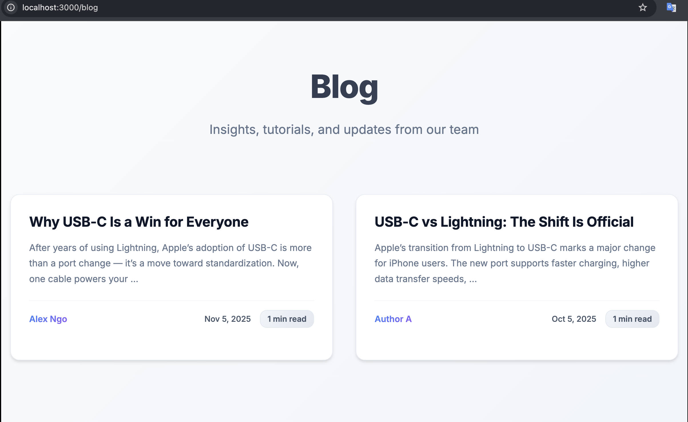

# Kobizo Technical Assignment

A comprehensive full-stack application built with a three-tier architecture consisting of Directus CMS, Node.js API Gateway, and Next.js Frontend.

## 📑 Table of Contents

- [🏗️ Architecture Overview](#️-architecture-overview)
- [📋 Prerequisites](#-prerequisites)
- [🚀 Quick Start](#-quick-start)
- [📁 Project Structure](#-project-structure)
- [🔧 Detailed Setup Instructions](#-detailed-setup-instructions)
  - [Component 1: Directus CMS (Backend)](#component-1-directus-cms-backend)
  - [Component 2: API Gateway (Middleware)](#component-2-api-gateway-middleware)
  - [Component 3: Frontend (User Interface)](#component-3-frontend-user-interface)
- [📮 API Testing with Postman](#-api-testing-with-postman)
- [🧪 Testing](#-testing)
- [🐛 Troubleshooting](#-troubleshooting)
- [🚀 Production Deployment](#-production-deployment)
- [🔄 Headless CI/CD Strategy](#-headless-cicd-strategy)
- [📚 Additional Resources](#-additional-resources)
- [🤝 Contributing](#-contributing)
- [📄 License](#-license)

## 📸 Screenshots

### Application Screenshots

#### Frontend Pages


_Home page with product listings and navigation_


_Product page with detailed product information and filters_


_Blog page showcasing content management capabilities_


_Authentication modal with login and registration forms_

#### Backend & Testing


_Directus CMS admin panel for content management_


_Comprehensive unit test coverage for the API Gateway_


_Integration tests demonstrating full-stack functionality_

## 🏗️ Architecture Overview

This project implements a modern three-tier architecture:

```
┌─────────────────┐    ┌─────────────────┐    ┌─────────────────┐
│   Next.js       │    │   Node.js       │    │   Directus      │
│   Frontend      │◄──►│   API Gateway   │◄──►│   CMS           │
│   (Port 3000)   │    │   (Port 3001)   │    │   (Port 8055)   │
└─────────────────┘    └─────────────────┘    └─────────────────┘
        │                       │                       │
        │                       │                       │
        ▼                       ▼                       ▼
┌─────────────────┐    ┌─────────────────┐    ┌─────────────────┐
│   User Interface│    │   Authentication│    │   PostgreSQL    │
│   & Experience  │    │   & Business    │    │   Database      │
│                 │    │   Logic         │    │   (Port 5432)   │
└─────────────────┘    └─────────────────┘    └─────────────────┘
```

## 📋 Prerequisites

Before starting, ensure you have the following installed:

- **Node.js** (v22 or higher) - [Download here](https://nodejs.org/)
- **Docker** and **Docker Compose** - [Download here](https://www.docker.com/)
- **Git** - [Download here](https://git-scm.com/)

## 🚀 Quick Start

### 1. Clone the Repository

```bash
git clone <repository-url>
cd kobizo-technical-assignment
```

### 2. Start Directus (CMS & Database)

```bash
cd directus-local
docker compose up -d
```

Wait for services to be healthy (about 30-60 seconds), then access:

- **Directus Admin Panel**: http://localhost:8055
- **Default Admin Credentials**:
  - Email: `admin@example.com`
  - Password: `Admin1234!`

### 3. Start API Gateway

```bash
cd ../api-gateway
npm install
cp env.example .env
npm run dev
```

The API Gateway will be available at: http://localhost:3001

### 4. Start Frontend

```bash
cd ../front-end
npm install
npm run dev
```

The frontend will be available at: http://localhost:3000

## 📁 Project Structure

```
kobizo-technical-assignment/
├── directus-local/          # Directus CMS with PostgreSQL
│   └── docker-compose.yml
├── api-gateway/             # Node.js API Gateway
│   ├── src/
│   │   ├── controllers/     # API controllers
│   │   ├── middleware/      # Authentication & error handling
│   │   ├── routes/          # API routes
│   │   └── tests/           # Test suites
│   └── package.json
├── front-end/               # Next.js Frontend
│   ├── src/
│   │   ├── app/            # Next.js app router
│   │   ├── components/      # React components
│   │   ├── hooks/          # Custom hooks
│   │   └── lib/            # Utilities
│   └── package.json
├── api-gateway.postman_collection.json  # Postman collection for API testing
└── README.MD               # This file
```

## 🔧 Detailed Setup Instructions

### Component 1: Directus CMS (Backend)

Directus provides the content management system and database layer.

#### Setup Steps:

1. **Navigate to Directus directory:**

   ```bash
   cd directus-local
   ```

2. **Start services with Docker Compose:**

   ```bash
   docker compose up -d
   ```

3. **Verify services are running:**

   ```bash
   docker compose ps
   ```

4. **Access Directus Admin Panel:**
   - URL: http://localhost:8055
   - Email: `admin@example.com`
   - Password: `Admin1234!`

#### Configuration:

The `docker-compose.yml` includes:

- **PostgreSQL Database** (Port 5432)
- **Directus CMS** (Port 8055)
- **Persistent volumes** for data storage
- **Health checks** for service dependencies

#### Data Management:

1. **Create Collections:**

   - Go to Settings → Data Model
   - Create collections for your data (e.g., products, blog posts)

2. **Add Sample Data:**

   - Use the Directus interface to create and manage content
   - Set up relationships between collections
   - Configure permissions and roles

3. **API Access:**
   - Directus automatically provides REST and GraphQL APIs
   - Access at: http://localhost:8055/items/{collection}

### Component 2: API Gateway (Middleware)

The Node.js API Gateway handles authentication, business logic, and acts as a proxy between the frontend and Directus.

#### Setup Steps:

1. **Navigate to API Gateway directory:**

   ```bash
   cd api-gateway
   ```

2. **Install dependencies:**

   ```bash
   npm install
   ```

3. **Configure environment:**

   ```bash
   cp env.example .env
   ```

4. **Update environment variables in `.env`:**

   ```env
   PORT=3001
   NODE_ENV=development
   DIRECTUS_URL=http://localhost:8055
   DIRECTUS_EMAIL=admin@example.com
   DIRECTUS_PASSWORD=Admin1234!
   JWT_SECRET=your-super-secret-jwt-key
   JWT_EXPIRES_IN=24h
   CORS_ORIGIN=http://localhost:3000
   ```

5. **Start development server:**
   ```bash
   npm run dev
   ```

#### Available Scripts:

- `npm run dev` - Start development server with hot reload
- `npm run build` - Build for production
- `npm start` - Start production server
- `npm test` - Run test suite
- `npm run test:watch` - Run tests in watch mode
- `npm run lint` - Run ESLint
- `npm run lint:fix` - Fix ESLint issues

#### API Endpoints:

**Authentication:**

- `POST /api/v1/auth/login` - User login
- `POST /api/v1/auth/register` - User registration
- `POST /api/v1/auth/logout` - User logout
- `GET /api/v1/auth/me` - Get current user

**Products:**

- `GET /api/v1/products` - Get all products
- `GET /api/v1/products/:id` - Get product by ID

**Blog:**

- `GET /api/v1/blog` - Get all blog posts
- `GET /api/v1/blog/:slug` - Get blog post by slug

**Checkout:**

- `POST /api/v1/checkout` - Process checkout

## 📮 API Testing with Postman

A comprehensive Postman collection is provided for testing all API endpoints. The collection includes pre-configured requests with authentication handling.

### Import the Collection

1. **Download the Collection:**

   - The collection file is located at: `api-gateway.postman_collection.json`

2. **Import into Postman:**
   - Open Postman
   - Click "Import" button
   - Select the `api-gateway.postman_collection.json` file
   - The collection will be imported with all requests

### Collection Features

The Postman collection includes:

#### 🔐 Authentication Flow

- **Login Request**: Automatically captures and stores the access token
- **Token Management**: Uses collection variables to store and reuse tokens
- **Auto-Authentication**: All protected endpoints automatically use the stored token

#### 📋 Available Requests

1. **Health Check**

   - `GET /health` - Verify API Gateway is running

2. **Authentication**

   - `POST /api/v1/auth/login` - User login with automatic token storage
   - Pre-configured with default admin credentials

3. **Products**

   - `GET /api/v1/products` - Get all products (requires authentication)
   - `GET /api/v1/products/:id` - Get product by ID (requires authentication)

4. **Blog**

   - `GET /api/v1/blog` - Get all blog posts (public endpoint)
   - `GET /api/v1/blog/:slug` - Get blog post by slug (public endpoint)

5. **Checkout**
   - `POST /api/v1/checkout` - Process checkout with sample items (requires authentication)

### Using the Collection

#### Step 1: Start the Services

```bash
# Start Directus
cd directus-local
docker compose up -d

# Start API Gateway
cd ../api-gateway
npm run dev
```

#### Step 2: Run the Login Request

1. Open the "Login" request in Postman
2. The request is pre-configured with admin credentials:
   - Email: `admin@example.com`
   - Password: `Admin1234!`
3. Send the request
4. The access token will be automatically stored in collection variables

#### Step 3: Test Protected Endpoints

- All other requests will automatically use the stored token
- No need to manually copy/paste tokens
- Simply run any request to test the API

### Collection Variables

The collection uses the following variables:

- `{{access_token}}` - Automatically set after successful login
- Base URL: `http://localhost:3001` (configurable)

### Sample Request Bodies

#### Login Request:

```json
{
  "email": "admin@example.com",
  "password": "Admin1234!"
}
```

#### Checkout Request:

```json
{
  "items": [
    {
      "productId": "1",
      "quantity": 2
    },
    {
      "productId": "2",
      "quantity": 1
    }
  ]
}
```

### Troubleshooting

1. **Token Not Set**: Ensure the Login request ran successfully and check the console for token storage confirmation
2. **401 Unauthorized**: Verify the API Gateway is running and the token is valid
3. **Connection Refused**: Ensure all services are running (Directus, API Gateway)

### Environment Setup

For different environments, you can:

1. **Create Environment Variables:**

   - `base_url`: Change the base URL for different environments
   - `admin_email`: Override the default admin email
   - `admin_password`: Override the default admin password

2. **Update Collection Variables:**
   - Modify the base URL in collection settings
   - Update authentication credentials as needed

#### Testing:

```bash
# Run all tests
npm test

# Run tests with coverage
npm test -- --coverage

# Run tests in watch mode
npm run test:watch
```

### Component 3: Frontend (User Interface)

The Next.js frontend provides the user interface with modern React patterns.

#### Setup Steps:

1. **Navigate to Frontend directory:**

   ```bash
   cd front-end
   ```

2. **Install dependencies:**

   ```bash
   npm install
   ```

3. **Create environment file:**

   ```bash
   echo "NEXT_PUBLIC_API_URL=http://localhost:3001" > .env.local
   ```

4. **Start development server:**
   ```bash
   npm run dev
   ```

#### Available Scripts:

- `npm run dev` - Start development server
- `npm run build` - Build for production
- `npm start` - Start production server
- `npm run lint` - Run ESLint
- `npm test` - Run test suite
- `npm run test:watch` - Run tests in watch mode
- `npm run test:coverage` - Run tests with coverage

#### Features:

- **Modern React Patterns**: Hooks, Context API, and functional components
- **TypeScript**: Full type safety throughout the application
- **CSS Modules**: Scoped styling for maintainable CSS
- **Responsive Design**: Mobile-first approach
- **Authentication**: JWT-based authentication with context
- **API Integration**: React Query for efficient data fetching
- **Testing**: Comprehensive test coverage with Jest and React Testing Library

#### Key Components:

- **Header**: Navigation and authentication
- **ProductGrid**: Product listing with filters
- **ProductCard**: Individual product display
- **BlogPostCard**: Blog post preview
- **AuthModal**: Authentication forms
- **Pagination**: Content pagination

## 🧪 Testing

### API Gateway Tests:

```bash
cd api-gateway
npm test                    # Run all tests
npm run test:watch         # Watch mode
npm test -- --coverage     # With coverage
```

### Frontend Tests:

```bash
cd front-end
npm test                    # Run all tests
npm run test:watch         # Watch mode
npm run test:coverage      # With coverage
```

## 🐛 Troubleshooting

### Common Issues:

1. **Port Already in Use:**

   ```bash
   # Kill process on port 3000
   lsof -ti:3000 | xargs kill -9

   # Kill process on port 3001
   lsof -ti:3001 | xargs kill -9

   # Kill process on port 8055
   lsof -ti:8055 | xargs kill -9
   ```

2. **Docker Issues:**

   ```bash
   # Reset Docker containers
   docker compose down -v
   docker compose up -d
   ```

3. **Node Modules Issues:**

   ```bash
   # Clear node_modules and reinstall
   rm -rf node_modules package-lock.json
   npm install
   ```

4. **Database Connection Issues:**
   - Ensure Directus is running: `docker compose ps`
   - Check database health: `docker compose logs postgres`
   - Restart services: `docker compose restart`

### Environment Variables:

**API Gateway (.env):**

```env
PORT=3001
NODE_ENV=development
DIRECTUS_URL=http://localhost:8055
DIRECTUS_EMAIL=admin@example.com
DIRECTUS_PASSWORD=Admin1234!
JWT_SECRET=your-super-secret-jwt-key
JWT_EXPIRES_IN=24h
CORS_ORIGIN=http://localhost:3000
```

**Frontend (.env.local):**

```env
NEXT_PUBLIC_API_URL=http://localhost:3001
```

## 📊 Monitoring & Health Checks

### Service Health:

- **Directus**: http://localhost:8055/server/health
- **API Gateway**: http://localhost:3001/health
- **Frontend**: http://localhost:3000

### Logs:

```bash
# Directus logs
docker compose logs directus

# API Gateway logs (in terminal)
# Frontend logs (in terminal)
```

## 🚀 Production Deployment

### Build Commands:

```bash
# API Gateway
cd api-gateway
npm run build
npm start

# Frontend
cd front-end
npm run build
npm start
```

### Environment Variables:

Update environment variables for production:

- Change `NODE_ENV=production`
- Update `DIRECTUS_URL` to production Directus instance
- Update `CORS_ORIGIN` to production frontend URL
- Use secure JWT secrets

## 🔄 Headless CI/CD Strategy

### Overview

This architecture leverages a fully headless, modular design to maximize scalability, maintainability, and performance across the stack. Each component—Directus, Node.js API Gateway, and Next.js frontend—is deployed on optimized platforms, supporting independent development and automated CI/CD workflows.

### Deployment Architecture

- **Directus (Headless CMS)**

  - **Platform:** Directus Cloud.
  - **Benefits:** Zero-maintenance hosting, automatic updates, and integrated CDN for assets. Ideal for structured content management and rapid schema iteration.

- **Node.js API Gateway**

  - **Platform:** AWS Lambda (Serverless).
  - **Benefits:** On-demand scalability, pay-per-use model, and reduced infrastructure overhead. Integration with AWS API Gateway for secure and efficient request routing.

- **Next.js Frontend**
  - **Platform:** Vercel.
  - **Benefits:** Edge-deployed for global low-latency delivery, automatic builds from Git branches, and optimized caching/CDN for static and dynamic content.

### CI/CD and Automated Testing Integration

- **Version Control:** All repositories (Directus schema, Node.js API, and Next.js frontend) are managed via Git.
- **Pipeline Triggers:**
  - Commits to main or feature branches trigger automated build and test workflows.
- **Automated Testing Integration (from Task 2):**
  - **Node.js:** Unit and integration tests executed via Jest within the CI pipeline before deployment to AWS Lambda.
  - **Next.js:** Next.js: Integration and end-to-end (E2E) tests run with Playwright/Cypress in staging environments on Vercel to validate API interactions, page rendering, and data consistency.
- **Deployment Gates:** Only builds passing all tests proceed to production.
- **Monitoring:** Automated rollback and alerting integrated via AWS CloudWatch and Vercel Analytics.

This CI/CD strategy ensures continuous quality assurance, efficient scaling, and reliable releases across all headless components.

## 📚 Additional Resources

- [Directus Documentation](https://docs.directus.io/)
- [Next.js Documentation](https://nextjs.org/docs)
- [Express.js Documentation](https://expressjs.com/)
- [Docker Documentation](https://docs.docker.com/)

## 🤝 Contributing

1. Fork the repository
2. Create a feature branch
3. Make your changes
4. Add tests for new functionality
5. Run the test suite
6. Submit a pull request

## 📄 License

This project is licensed under the MIT License.
